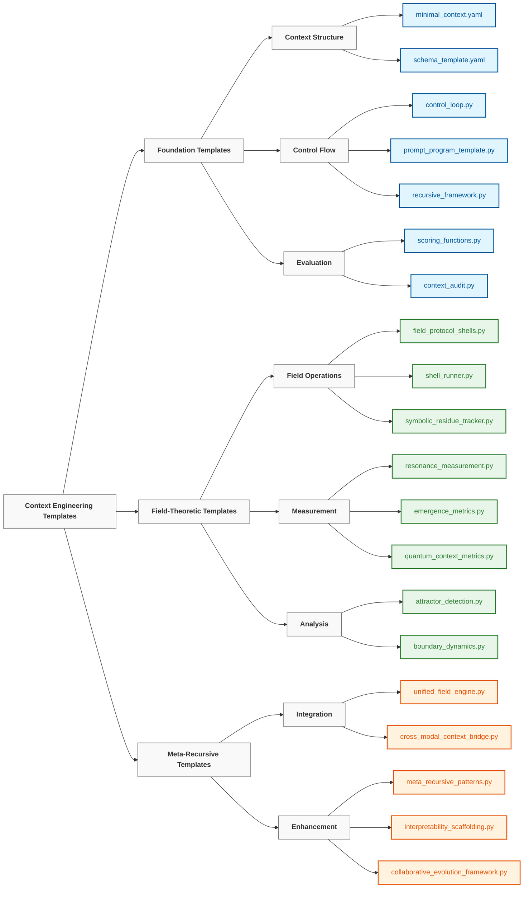

# Context Engineering Templates

> "We have to cease to think if we refuse to do it in the prison house of language." — **Friedrich Nietzsche**

## Overview

The `20_templates` directory provides a collection of reusable, composable components for implementing context engineering principles across a wide range of applications. Each template encapsulates a specific pattern or mechanism that can be combined to create sophisticated context management systems.

These templates follow a progressive complexity model, starting with basic structures and building toward advanced field-theoretic implementations:

```
atoms → molecules → cells → organs → neural systems → neural fields
  │        │         │        │             │              │
single    few-     memory/   multi-    cognitive tools   fields +
prompt    shot     agents    agents    prompt programs   persistence
```

## Template Categories



### Foundation Templates

Fundamental building blocks for basic context engineering:

| Template | Purpose | Usage |
|----------|---------|-------|
| [`minimal_context.yaml`](./minimal_context.yaml) | Lightweight template for general-purpose LLM interactions | Starting point for any context engineering project |
| [`schema_template.yaml`](./schema_template.yaml) | Data structure definitions for standardized context formats | Ensuring consistent context representation |
| [`control_loop.py`](./control_loop.py) | Framework for iterative context processing | Implementing cyclic refinement workflows |
| [`prompt_program_template.py`](./prompt_program_template.py) | Structured prompting patterns for complex reasoning | Creating code-like reasoning structures |
| [`scoring_functions.py`](./scoring_functions.py) | Evaluation metrics for context quality | Quantitative assessment of context effectiveness |

### Field-Theoretic Templates

Advanced components implementing neural field theory principles:

| Template | Purpose | Usage |
|----------|---------|-------|
| [`field_protocol_shells.py`](./field_protocol_shells.py) | Templates for field operations | Implementing standardized field manipulation protocols |
| [`neural_field_context.yaml`](./neural_field_context.yaml) | Configuration for neural field-based context | Setting up continuous semantic fields |
| [`resonance_measurement.py`](./resonance_measurement.py) | Tools for measuring field harmony | Quantifying semantic relationships |
| [`attractor_detection.py`](./attractor_detection.py) | Techniques for identifying semantic attractors | Finding stable patterns in context fields |
| [`symbolic_residue_tracker.py`](./symbolic_residue_tracker.py) | System for monitoring symbolic fragments | Tracking persistent information |

### Meta-Recursive Templates

Advanced templates for self-improving and integrated systems:

| Template | Purpose | Usage |
|----------|---------|-------|
| [`meta_recursive_patterns.py`](./meta_recursive_patterns.py) | Patterns for self-improvement | Creating systems that enhance themselves |
| [`unified_field_engine.py`](./unified_field_engine.py) | Integration of multiple field operations | Coordinating complex field interactions |
| [`interpretability_scaffolding.py`](./interpretability_scaffolding.py) | Frameworks for transparency | Making operations understandable |
| [`collaborative_evolution_framework.py`](./collaborative_evolution_framework.py) | Human-AI partnership structures | Facilitating effective collaboration |
| [`cross_modal_context_bridge.py`](./cross_modal_context_bridge.py) | Multi-modal integration patterns | Unifying understanding across modalities |

## Implementation Strategy

These templates follow a consistent implementation strategy with the following principles:

1. **Layered Approach**: Building from foundational concepts to advanced integration
2. **Practical Focus**: Ensuring all theory has corresponding practical implementation
3. **Modular Design**: Creating composable components that can be recombined
4. **Progressive Complexity**: Starting simple, adding sophistication incrementally
5. **Integration Emphasis**: Focusing on how components work together, not just individually
6. **Self-Improvement**: Building systems that can enhance themselves
7. **Transparency**: Ensuring operations remain understandable despite complexity
8. **Collaboration**: Designing for effective human-AI partnership
9. **Modal Flexibility**: Supporting unified understanding across different modalities

## Usage Patterns

### Basic Template Adaptation

Templates can be adapted through simple configuration changes:

```python
import yaml

# Load the template
with open('minimal_context.yaml', 'r') as f:
    context_template = yaml.safe_load(f)

# Customize for your specific use case
context_template['system']['role'] = "specialized_assistant"
context_template['token_budget'] = 500

# Use the customized template
# ...
```

### Component Composition

Combine multiple templates to create sophisticated systems:

```python
from templates.prompt_program_template import PromptProgram
from templates.field_protocol_shells import ProtocolShell

# Create a prompt program
program = PromptProgram("Solve complex reasoning tasks")
program.add_step("Parse the problem")
program.add_step("Identify relevant concepts")
# ...

# Integrate with protocol shell
protocol = ProtocolShell.from_file("path/to/reasoning.shell")
protocol_program = protocol.create_program(program)

# Execute the integrated system
result = protocol_program.execute(input_data)
```

### Progressive Enhancement

Start with basic templates and progressively enhance them:

1. Begin with `minimal_context.yaml` for simple interactions
2. Add structured evaluation using `scoring_functions.py`
3. Implement iterative refinement with `control_loop.py`
4. Introduce field dynamics using `field_protocol_shells.py`
5. Integrate self-improvement with `meta_recursive_patterns.py`

## Learning Path

For those new to context engineering, we recommend the following learning path:

```
┌─────────────────┐     ┌──────────────────┐     ┌────────────────┐
│ minimal_context │     │ control_loop +   │     │ field_protocol │
│     .yaml       │────▶│ prompt_program   │────▶│    _shells     │
│                 │     │                  │     │                │
└─────────────────┘     └──────────────────┘     └────────────────┘
         │                                                │
         │                                                │
         ▼                                                ▼
┌─────────────────┐                             ┌────────────────┐
│    scoring_     │◀───────────────────────────▶│  resonance_    │
│   functions     │                             │  measurement   │
│                 │                             │                │
└─────────────────┘                             └────────────────┘
         ▲                                                ▲
         │                                                │
         └────────────────────┐               ┌───────────┘
                              ▼               ▼
                         ┌─────────────────────┐
                         │  meta_recursive_    │
                         │     patterns        │
                         │                     │
                         └─────────────────────┘
```

## Template Development

When creating new templates or modifying existing ones, follow these guidelines:

1. **Maintain Compatibility**: Ensure new templates work with existing ones
2. **Document Thoroughly**: Include clear documentation and examples
3. **Progressive Enhancement**: Design for gradual adoption and extension
4. **Test Comprehensively**: Verify templates across different scenarios
5. **Provide Defaults**: Include sensible defaults for all parameters

## Additional Resources

- See [`../00_foundations/`](../00_foundations/) for theoretical background
- See [`../10_guides_zero_to_hero/`](../10_guides_zero_to_hero/) for practical tutorials
- See [`../30_examples/`](../30_examples/) for complete implementations
- See [`../40_reference/`](../40_reference/) for detailed documentation

---

*This directory is actively maintained and expanded with new templates as the field of context engineering evolves. Contributions are welcome via pull requests.*
