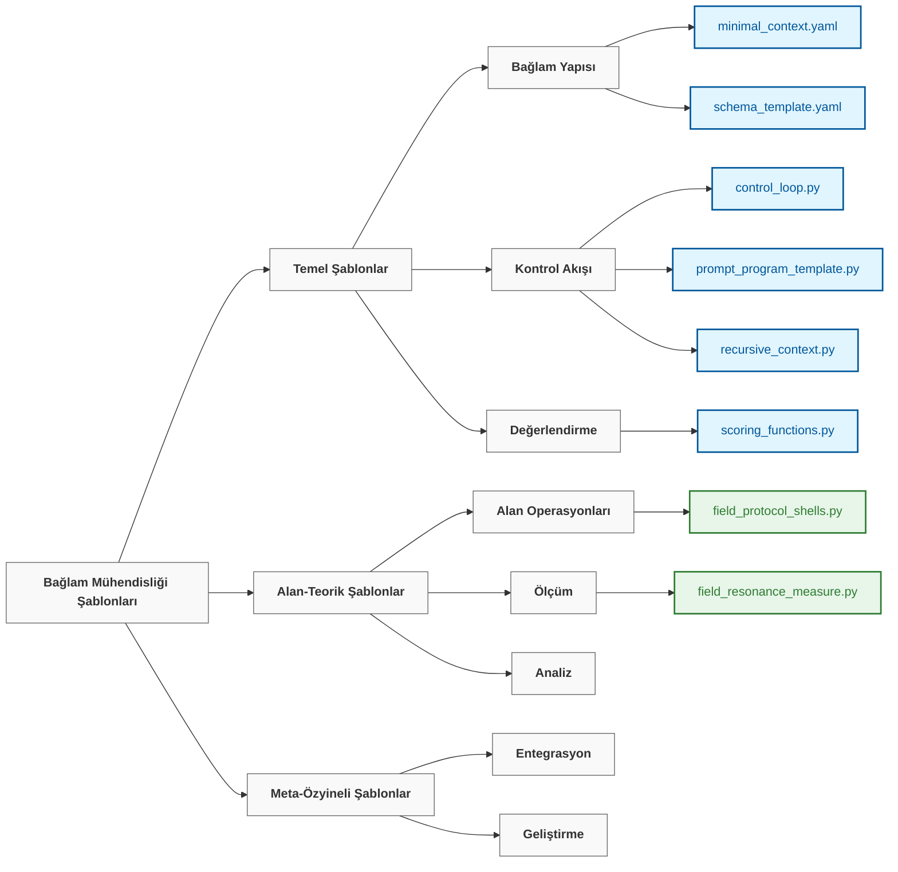

# Bağlam Mühendisliği Şablonları

> "Dilin hapishanesinde düşünmeyi reddedersek, düşünmeyi bırakmak zorunda kalırız." — **Friedrich Nietzsche**

## Genel Bakış

`20_templates` dizini, bağlam mühendisliği ilkelerini çok çeşitli uygulamalarda hayata geçirmek için yeniden kullanılabilir, birleştirilebilir bileşenlerden oluşan bir koleksiyon sunar. Her şablon, karmaşık bağlam yönetimi sistemleri oluşturmak için birleştirilebilen belirli bir deseni veya mekanizmayı kapsar.

Bu şablonlar, temel yapılardan başlayıp gelişmiş alan-teorik uygulamalara doğru ilerleyen, artan bir karmaşıklık modelini takip eder:

```
atomlar → moleküller → hücreler → organlar → sinir sistemleri → nöral alanlar
  │          │           │          │             │                │
tekil     az sayıda    hafıza/    çoklu      bilişsel araçlar   alanlar +
komut     örnekli      ajanlar    ajanlar    komut programları    kalıcılık
```

## Şablon Kategorileri



### Temel Şablonlar

Temel bağlam mühendisliği için temel yapı taşları:

| Şablon | Amaç | Kullanım |
|----------|---------|-------|
| [`minimal_context.yaml`](./minimal_context.yaml) | Genel amaçlı LLM etkileşimleri için hafif bir şablon | Herhangi bir bağlam mühendisliği projesi için başlangıç noktası |
| [`schema_template.yaml`](./schema_template.yaml) | Standartlaştırılmış bağlam formatları için veri yapısı tanımları | Tutarlı bağlam temsilini sağlama |
| [`control_loop.py`](./control_loop.py) | Yinelemeli bağlam işleme için çerçeve | Döngüsel iyileştirme iş akışlarını uygulama |
| [`prompt_program_template.py`](./prompt_program_template.py) | Karmaşık akıl yürütme için yapılandırılmış komut desenleri | Kod benzeri akıl yürütme yapıları oluşturma |
| [`scoring_functions.py`](./scoring_functions.py) | Bağlam kalitesi için değerlendirme metrikleri | Bağlam etkinliğinin nicel değerlendirmesi |

### Alan-Teorik Şablonlar

Nöral alan teorisi ilkelerini uygulayan gelişmiş bileşenler:

| Şablon | Amaç | Kullanım |
|----------|---------|-------|
| [`field_protocol_shells.py`](./field_protocol_shells.py) | Alan operasyonları için şablonlar | Standartlaştırılmış alan manipülasyon protokollerini uygulama |
| [`neural_field_context.yaml`](./neural_field_context.yaml) | Nöral alan tabanlı bağlam için yapılandırma | Sürekli anlamsal alanlar kurma |
| [`field_resonance_measure.py`](./field_resonance_measure.py) | Alan uyumunu ölçmek için araçlar | Anlamsal ilişkileri niceleme |

### Meta-Özyineli Şablonlar

Kendi kendini geliştiren ve entegre sistemler için gelişmiş şablonlar:

| Şablon | Amaç | Kullanım |
|----------|---------|-------|
| [`recursive_context.py`](./recursive_context.py) | Kendi kendini iyileştirme için desenler | Kendilerini geliştiren sistemler oluşturma |

## Uygulama Stratejisi

Bu şablonlar, aşağıdaki ilkelere sahip tutarlı bir uygulama stratejisi izler:

1.  **Katmanlı Yaklaşım**: Temel kavramlardan gelişmiş entegrasyona doğru inşa etme
2.  **Pratik Odak**: Tüm teorinin karşılık gelen pratik uygulamaya sahip olmasını sağlama
3.  **Modüler Tasarım**: Yeniden birleştirilebilen bileşenler oluşturma
4.  **Aşamalı Karmaşıklık**: Basit başlayıp, karmaşıklığı kademeli olarak artırma
5.  **Entegrasyon Vurgusu**: Bileşenlerin sadece bireysel olarak değil, birlikte nasıl çalıştığına odaklanma
6.  **Kendi Kendini İyileştirme**: Kendilerini geliştirebilen sistemler inşa etme
7.  **Şeffaflık**: Karmaşıklığa rağmen operasyonların anlaşılır kalmasını sağlama
8.  **İşbirliği**: Etkili insan-AI ortaklığı için tasarlama
9.  **Modal Esneklik**: Farklı modaliteler arasında birleşik anlayışı destekleme

## Kullanım Desenleri

### Temel Şablon Uyarlaması

Şablonlar, basit yapılandırma değişiklikleriyle uyarlanabilir:

```python
import yaml

# Şablonu yükle
with open('minimal_context.yaml', 'r') as f:
    context_template = yaml.safe_load(f)

# Özel kullanım durumunuz için özelleştirin
context_template['system']['role'] = "uzmanlaşmış_asistan"
context_template['token_budget'] = 500

# Özelleştirilmiş şablonu kullan
# ...
```

### Bileşen Birleştirme

Karmaşık sistemler oluşturmak için birden çok şablonu birleştirin:

```python
from templates.prompt_program_template import PromptProgram
from templates.field_protocol_shells import ProtocolShell

# Bir komut programı oluştur
program = PromptProgram("Karmaşık akıl yürütme görevlerini çöz")
program.add_step("Problemi ayrıştır")
program.add_step("İlgili kavramları belirle")
# ...

# Protokol kabuğu ile entegre et
protocol = ProtocolShell.from_file("path/to/reasoning.shell")
protocol_program = protocol.create_program(program)

# Entegre sistemi yürüt
result = protocol_program.execute(input_data)
```

### Aşamalı Geliştirme

Temel şablonlarla başlayın ve onları aşamalı olarak geliştirin:

1.  Basit etkileşimler için `minimal_context.yaml` ile başlayın
2.  `scoring_functions.py` kullanarak yapılandırılmış değerlendirme ekleyin
3.  `control_loop.py` ile yinelemeli iyileştirme uygulayın
4.  `field_protocol_shells.py` kullanarak alan dinamiklerini tanıtın
5.  `recursive_context.py` ile kendi kendini iyileştirme entegre edin

## Öğrenme Yolu

Bağlam mühendisliğine yeni başlayanlar için aşağıdaki öğrenme yolunu öneriyoruz:

```
┌─────────────────┐     ┌──────────────────┐     ┌────────────────┐
│ minimal_context │     │ control_loop +   │     │ field_protocol │
│     .yaml       │────▶│ prompt_program   │────▶│    _shells     │
│                 │     │                  │     │                │
└─────────────────┘     └──────────────────┘     └────────────────┘
         │                                                │
         │                                                │
         ▼                                                ▼
┌─────────────────┐                             ┌────────────────┐
│    scoring_     │◀───────────────────────────▶│  field_resonance_│
│   functions     │                             │  measure       │
│                 │                             │                │
└─────────────────┘                             └────────────────┘
         ▲                                                ▲
         │                                                │
         └────────────────────┐               ┌───────────┘
                              ▼               ▼
                         ┌─────────────────────┐
                         │  recursive_context  │
                         │                     │
                         │                     │
                         └─────────────────────┘
```

## Şablon Geliştirme

Yeni şablonlar oluştururken veya mevcut olanları değiştirirken şu yönergeleri izleyin:

1.  **Uyumluluğu Koruyun**: Yeni şablonların mevcut olanlarla çalıştığından emin olun
2.  **Kapsamlı Belgeleyin**: Açık belgeler ve örnekler ekleyin
3.  **Aşamalı Geliştirme**: Kademeli benimseme ve genişletme için tasarlayın
4.  **Kapsamlı Test Edin**: Şablonları farklı senaryolarda doğrulayın
5.  **Varsayılanlar Sağlayın**: Tüm parametreler için mantıklı varsayılanlar ekleyin

## Ek Kaynaklar

- Teorik arka plan için [`../00_foundations/`](../00_foundations/) bölümüne bakın
- Pratik eğitimler için [`../10_guides_zero_to_hero/`](../10_guides_zero_to_hero/) bölümüne bakın
- Tam uygulamalar için [`../30_examples/`](../30_examples/) bölümüne bakın
- Ayrıntılı belgeler için [`../40_reference/`](../40_reference/) bölümüne bakın

---

*Bu dizin, bağlam mühendisliği alanı geliştikçe yeni şablonlarla aktif olarak korunmakta ve genişletilmektedir. Pull request yoluyla katkılar memnuniyetle karşılanır.*