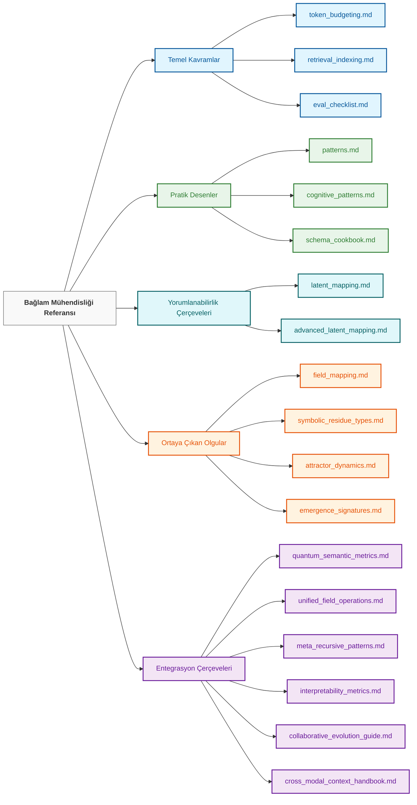

# Bağlam Mühendisliği: Referans Dokümantasyon

> "Doğayı, ana dilimizin belirlediği çizgiler boyunca parçalara ayırırız."
>
> [**— Benjamin Lee Whorf**](https://en.wikipedia.org/wiki/Benjamin_Lee_Whorf), [**Sapir-Whorf Dilsel Görecelik Hipotezi**](https://en.wikipedia.org/wiki/Linguistic_relativity)'nin babası
>
> 
> Dilin düşünceyi etkilediği kavramı, tersi değil
>
> Bu, özellikle ajan benzeri düşünceyi yönlendirmek ve hata ayıklamakla görevli olduğumuz Bağlam Mühendisliği alanımızda geçerlidir

## Genel Bakış

Bağlam Mühendisliği deposunun Referans Dokümantasyon bölümüne hoş geldiniz. Bu dizin, bağlam mühendisliği uygulamaları için teorik temel ve pratik referans görevi gören kapsamlı kılavuzlar, taksonomiler ve teknik özellikler içerir.

Bu referans materyalleri, `10_guides_zero_to_hero` ve `30_examples` dizinlerinde bulunan daha uygulamalı kılavuzları tamamlamak üzere tasarlanmıştır ve temel kavramlar, desenler ve çerçeveler hakkında daha derin bir içgörü sağlar.

```
┌─────────────────────────────────────────────────────────┐
│                REFERANS MİMARİSİ                   │
├─────────────────────────────────────────────────────────┤
│                                                         │
│  TEMELLER → DESENLER → OLGULAR → UYGULAMALAR      │
│  (Kavramlar)    (Yöntemler)   (Etkiler)    (Kullanım Durumları)     │
│                                                         │
│  • Altta yatan teoriyi anlama                  │
│  • Ortak bir kelime dağarcığı oluşturma                         │
│  • Değerlendirme çerçeveleri oluşturma                   │
│  • Alan fikir birliğini ve açık soruları belgeleme       │
│  • Tasarım desenleri ve en iyi uygulamaları sağlama         │
│                                                         │
└─────────────────────────────────────────────────────────┘
```

## Bu Dizin Nasıl Kullanılır

Referans dokümantasyonu, farklı öğrenme ve uygulama ihtiyaçlarını desteklemek için beş ana kategoriye ayrılmıştır:

1. **Temel Kavramlar**: Bağlam mühendisliğini destekleyen temel ilkeler ve çerçeveler
2. **Pratik Desenler**: Uygulama için tasarım desenleri, şemalar ve metodolojiler
3. **Yorumlanabilirlik Çerçeveleri**: Yapay zeka akıl yürütmesini anlamak ve görselleştirmek için araçlar ve yöntemler
4. **Ortaya Çıkan Olgular**: Bağlam sistemlerindeki karmaşık ortaya çıkan özelliklerin belgelenmesi
5. **Entegrasyon Çerçeveleri**: Yaklaşımları kapsamlı sistemlere birleştirmek için kılavuzlar

### Öğrenme Yolu

Bağlam mühendisliğine yeni başlayanlar için aşağıdaki öğrenme yolunu öneriyoruz:



## Dizin İçeriği

### Temel Kavramlar

| Belge | Açıklama | Anahtar Uygulamalar |
|----------|-------------|------------------|
| **[token_budgeting.md](./token_budgeting.md)** | Kaynak tahsisi stratejileriyle jeton kullanımını optimize etmeye yönelik kapsamlı kılavuz | Bütçe planlaması, maliyet optimizasyonu, bağlam penceresi yönetimi |
| **[retrieval_indexing.md](./retrieval_indexing.md)** | Bilgi erişim sistemleri ve dizinleme metodolojileri için referans | RAG uygulamaları, bilgi tabanı tasarımı, erişim optimizasyonu |
| **[eval_checklist.md](./eval_checklist.md)** | Bağlam mühendisliği sistemleri için değerlendirme metodolojisi ve kriterleri | Kalite değerlendirmesi, performans ölçümü, sistem doğrulaması |

### Pratik Desenler

| Belge | Açıklama | Anahtar Uygulamalar |
|----------|-------------|------------------|
| **[patterns.md](./patterns.md)** | Bağlam mühendisliği sistemleri için genel tasarım desenleri | Mimari tasarım, çözüm geliştirme, desen tanıma |
| **[cognitive_patterns.md](./cognitive_patterns.md)** | Yapay zeka bilişsel yeteneklerini geliştirmek için akıl yürütme desenleri kütüphanesi | Akıl yürütme geliştirme, bilişsel iskele, problem çözme çerçeveleri |
| **[schema_cookbook.md](./schema_cookbook.md)** | Yapılandırılmış bilgi temsili için şema tasarım desenleri koleksiyonu | Veri modelleme, bilgi temsili, bilgi organizasyonu |

### Yorumlanabilirlik Çerçeveleri

| Belge | Açıklama | Anahtar Uygulamalar |
|----------|-------------|------------------|
| **[latent_mapping.md](./latent_mapping.md)** | Yapay zeka gizli uzaylarının görselleştirilmesi ve analizine giriş | Model anlama, kavram haritalama, temsil görselleştirme |
| **[advanced_latent_mapping.md](./advanced_latent_mapping.md)** | Gizli uzay aracılığıyla yapay zeka akıl yürütmesini izlemek ve analiz etmek için gelişmiş teknikler | Devre izleme, kalıntı tespiti, alan mutasyonu, meta-analiz |

### Ortaya Çıkan Olgular

| Belge | Açıklama | Anahtar Uygulamalar |
|----------|-------------|------------------|
| **[field_mapping.md](./field_mapping.md)** | Anlamsal alanları görselleştirme ve anlama kılavuzu | Alan teorisi uygulamaları, anlamsal uzayda gezinme, kavramsal haritalama |
| **[symbolic_residue_types.md](./symbolic_residue_types.md)** | Sembolik kalıntıların taksonomisi ve sınıflandırılması | Akıl yürütme analizi, önyargı tespiti, yorumlanabilirlik araştırması |
| **[attractor_dynamics.md](./attractor_dynamics.md)** | Bağlam sistemlerindeki çekici davranışı ve dinamikleri için referans | Çekici tasarımı, kararlılık mühendisliği, anlamsal yerçekimi kontrolü |
| **[emergence_signatures.md](./emergence_signatures.md)** | Ortaya çıkan desenleri tanıma ve bunlarla çalışma kılavuzu | Ortaya çıkan özellik tespiti, karmaşık sistem analizi, öngörülemeyen davranış yönetimi |

### Entegrasyon Çerçeveleri

| Belge | Açıklama | Anahtar Uygulamalar |
|----------|-------------|------------------|
| **[quantum_semantic_metrics.md](./quantum_semantic_metrics.md)** | Gözlemciye bağlı anlamsal yorumlama için metrikler | Çoklu perspektif analizi, belirsizlik ölçümü, yorumlayıcı çerçeve tasarımı |
| **[unified_field_operations.md](./unified_field_operations.md)** | Birden çok alanda entegre alan işlemleri kılavuzu | Alanlar arası entegrasyon, bütünsel sistem tasarımı, alan uyumlaştırma |
| **[meta_recursive_patterns.md](./meta_recursive_patterns.md)** | Kendi kendini geliştiren ve özyinelemeli sistemler için desenler | Kendi kendine optimizasyon, özyinelemeli geliştirme, meta-bilişsel çerçeveler |
| **[interpretability_metrics.md](./interpretability_metrics.md)** | Sistem şeffaflığı için metrikler ve metodolojiler | Şeffaflık ölçümü, yorumlanabilirlik değerlendirmesi, açıklanabilirlik çerçeveleri |
| **[collaborative_evolution_guide.md](./collaborative_evolution_guide.md)** | İnsan-yapay zeka işbirlikçi geliştirme kılavuzu | Ortaklık tasarımı, birlikte evrim çerçeveleri, işbirlikçi zeka |
| **[cross_modal_context_handbook.md](./cross_modal_context_handbook.md)** | Çok modlu entegrasyon için el kitabı | Çok modlu sistemler, birleşik temsiller, modalite köprüleme |

## Gizli Haritalama: Yapay Zeka Akıl Yürütmesini Anlama

Gizli haritalama belgeleri, yapay zeka akıl yürütme süreçlerini anlamak ve görselleştirmek için temel çerçeveler sağlar:

```
┌─────────────────────────────────────────────────────────┐
│               GİZLİ HARİTALAMA İLERLEMESİ               │
├─────────────────────────────────────────────────────────┤
│                                                         │
│  TEMELLER       →       GELİŞMİŞ TEKNİKLER          │
│  latent_mapping.md         advanced_latent_mapping.md   │
│                                                         │
│  • Temel görselleştirme     • Devre izleme            │
│  • Kavram haritalama         • Sembolik kalıntı tespiti │
│  • Dikkat desenleri      • Kabuk istifleme analizi    │
│  • Basit müdahaleler    • Alan mutasyon teknikleri  │
│  • Temsil analizi • Meta-özyinelemeli analiz    │
│                                                         │
└─────────────────────────────────────────────────────────┘
```

### Temelden Gelişmiş Gizli Haritalamaya

Gizli haritalama belgeleri aşamalı bir öğrenme yolu oluşturur:

1. **Temel Anlayış** (latent_mapping.md)
   - Temel yapay zeka düşünce süreçlerini görselleştirmeyi öğrenin
   - Gizli uzayda kavram temsillerini haritalayın
   - Dikkat mekanizmalarını anlayın
   - Basit müdahaleler yapın

2. **Gelişmiş Analiz** (advanced_latent_mapping.md)
   - Sinir devrelerini elektrik yolları gibi izleyin
   - Yapay zeka akıl yürütmesinin bıraktığı sembolik kalıntıyı izleyin
   - Katmanlı anlamı anlamak için bağlamsal kabukları istifleyin
   - Düşünce alanlarını gerçek zamanlı olarak mutasyona uğratın

Bu belgeler özellikle şunlar için değerlidir:
- Yapay zeka sistemlerinin gerçekte nasıl akıl yürüttüğünü anlama
- Önyargıları ve başarısızlık modlarını tespit etme
- Karmaşık sistemlerin yorumlanabilirliğini artırma
- Daha etkili bağlam mühendisliği çözümleri tasarlama

## Uygulama Metodolojisi

Referans materyalleri yapılandırılmış bir uygulama metodolojisini destekler:

```
┌─────────────────────────────────────────────────────────┐
│               UYGULAMA İŞ AKIŞI                   │
├─────────────────────────────────────────────────────────┤
│                                                         │
│  1. ANALİZ ET                                             │
│     ↓                                                   │
│     • Sistem gereksinimlerini anla                    │
│     • Bağlam mühendisliği hedeflerini tanımla             │
│     • Kaynak kısıtlamalarını belirle                     │
│                                                         │
│  2. TASARLA                                              │
│     ↓                                                   │
│     • Uygun desenleri seç                       │
│     • Alan mimarisini tanımla                         │
│     • Şema yapıları oluştur                          │
│                                                         │
│  3. UYGULA                                           │
│     ↓                                                   │
│     • Jeton bütçe planı oluştur                           │
│     • Bağlam yapıları geliştir                        │
│     • Alan işlemlerini entegre et                        │
│                                                         │
│  4. DEĞERLENDİR                                            │
│     ↓                                                   │
│     • Değerlendirme kontrol listesini uygula                        │
│     • Performans metriklerini ölç                       │
│     • Yorumlanabilirliği değerlendir                           │
│                                                         │
│  5. İYİLEŞTİR                                              │
│     ↓                                                   │
│     • Jeton tahsisini optimize et                         │
│     • Alan dinamiklerini geliştir                            │
│     • Meta-özyinelemeli iyileştirmeler uygula             │
│                                                         │
└─────────────────────────────────────────────────────────┘
```

## Uygulama Alanları

Bu referans materyalleri geniş bir uygulama alanını destekler:

### Temel Uygulamalar

- **Sohbet Yapay Zekası**: Diyalog sistemlerinde tutarlılığı, hafızayı ve akıl yürütmeyi geliştirin
- **RAG Sistemleri**: Harici bilginin alınmasını ve entegrasyonunu optimize edin
- **İçerik Üretimi**: Üretilen içeriğin kalitesini, stilini ve tutarlılığını iyileştirin
- **Alan Uyarlaması**: Modelleri minimum ince ayarla belirli alanlara uyarlayın

### Gelişmiş Uygulamalar

- **Çoklu Ajan Sistemleri**: Karmaşık ajan etkileşimlerini tasarlayın ve düzenleyin
- **Ortaya Çıkan Davranış Kontrolü**: Ortaya çıkan özellikleri yönetin ve bunlardan yararlanın
- **Alan Tabanlı Akıl Yürütme**: Alan teorisini kullanarak karmaşık akıl yürütme çerçeveleri uygulayın
- **Kendi Kendine Gelişen Sistemler**: Özyinelemeli kendi kendine değişiklikle gelişen sistemler oluşturun
- **Yapay Zeka Yorumlanabilirlik Araştırması**: Model davranışını anlamak için gizli haritalama teknikleri uygulayın

## Teoriden Pratiğe

Referans dokümantasyonu, teori ve pratiği şu şekilde köprülemek için tasarlanmıştır:

```
┌─────────────────────────────────────────────────────────┐
│               TEORİ-PRATİK KÖPRÜSÜ                    │
├─────────────────────────────────────────────────────────┤
│                                                         │
│  KAVRAMSAL          │           PRATİK              │
│  ANLAYIŞ       │           UYGULAMA            │
│                      │                                  │
│  • Gizli uzay  ───────→ • Görselleştirme araçları         │
│    temsili    │                                  │
│                      │                                  │
│  • Alan teorisi  ───────→ • Alan uygulama        │
│                      │     teknikleri                   │
│                      │                                  │
│  • Sembolik      ───────→ • Kalıntı tespit yöntemleri   │
│    kalıntı           │                                  │
│                      │                                  │
│  • Ortaya çıkış     ───────→ • Ortaya çıkış yönetimi        │
│    desenleri          │     yaklaşımları                   │
│                      │                                  │
│  • Kuantum       ───────→ • Çoklu perspektif           │
│    semantiği         │     yorumlanabilirlik             │
│                      │                                  │
└─────────────────────────────────────────────────────────┘
```

## Katkı Yönergeleri

Bu referans dizini, bağlam mühendisliği alanıyla birlikte büyümek ve gelişmek üzere tasarlanmıştır. Aşağıdaki alanlarda katkılar memnuniyetle karşılanır:

- **Yeni Referans Belgeleri**: Ortaya çıkan kavramlar için ek referans materyalleri
- **Mevcut Belge Geliştirmeleri**: Mevcut belgelerde genişletmeler, açıklamalar ve güncellemeler
- **Görsel Yardımcılar**: Anlamayı artıran diyagramlar, grafikler ve görselleştirmeler
- **Vaka Çalışmaları**: Bu referans materyallerinin gerçek dünya problemlerine belgelenmiş uygulamaları
- **Entegrasyon Kılavuzları**: Diğer çerçeveler ve teknolojilerle entegrasyon için referanslar

Lütfen gönderim yönergeleri için ana depo [CONTRIBUTING.md](../../.github/CONTRIBUTING.md) dosyasına bakın.

## Gelecek Yönelimler

Referans materyalleri birkaç ana yönde gelişmeye devam edecektir:

1. **Nicel Metrikler**: Daha hassas ölçüm çerçevelerinin geliştirilmesi
2. **Çok Modlu Entegrasyon**: Çok modlu bağlam mühendisliği kapsamının genişletilmesi
3. **Sektöre Özgü Kılavuzlar**: Farklı sektörler için özel referans materyalleri
4. **Yorumlanabilirlik Çerçeveleri**: Bağlam sistemlerini anlamak için gelişmiş yöntemler
5. **Resmi Doğrulama**: Bağlam mühendisliği sistemlerini resmi olarak doğrulamak için yaklaşımlar
6. **Sembolik Kalıntı Analizi**: Kalıntı tespiti ve yorumlama tekniklerinin daha da geliştirilmesi
7. **Özyinelemeli Meta-Analiz**: Kendilerini analiz edip iyileştirebilen sistemler için geliştirilmiş çerçeveler

---

Bu README, `40_reference/` dizininde bulunan referans materyallerine genel bir bakış sunmaktadır. Daha uygulamalı rehberlik için lütfen `10_guides_zero_to_hero/` dizinine, pratik örnekler için ise `30_examples/` dizinine bakın.

Unutmayın ki bağlam mühendisliği hem bir sanat hem de bir bilimdir—bu referans materyalleri bilimsel temeli sağlar, ancak bunları etkili bir şekilde uygulamak pratik, deney ve yaratıcılık gerektirir.
